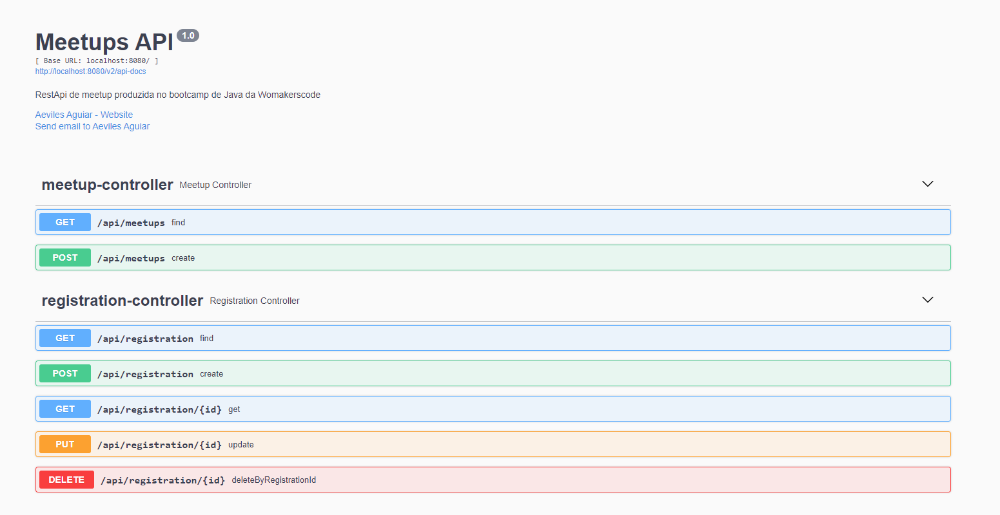
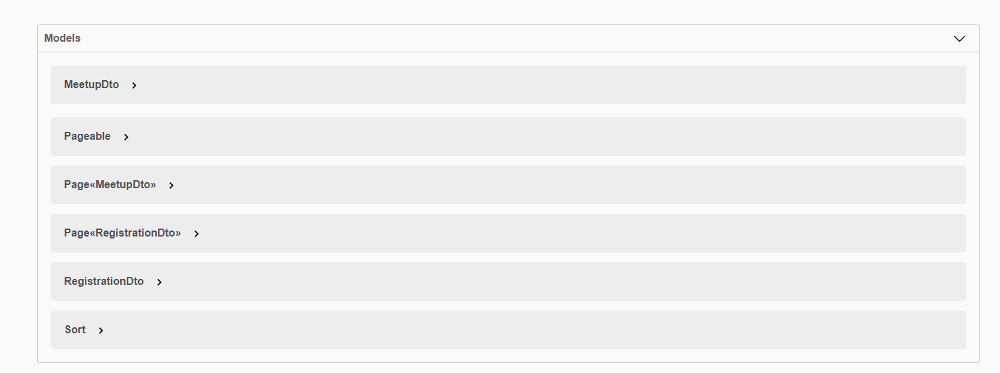

# Serviço de Agendamento de Meetup

## Projeto

Pequeno microserviço de cadastro de Meetup

## Tecnologias Usadas

- Java 11
- Maven
- Spring
- JPA
- TDD Test Driven Development
- TDD Test Driven Development
- Azure functions

## TODO List

- Implementação da classe se servico[ok]
- Testes no service[ok]
- Implementação da classe de controlle da web[ok]
- Testes de contrato no controller[ok]
- Testes unitarios no repository[ok]
- Implementação do repository[ok]
- Swagger[ok]
- Testes locais via postman[ok]
- Deploy no azure[ok]

## DTO

Um objeto de transferência de dados (DTO) é um objeto que transporta dados entre processos. Você pode usar essa técnica
para facilitar a comunicação entre dois sistemas (como uma API e seu servidor) sem expor potencialmente informações 
confidenciais.
DTO significa objeto de transferência de dados. Como o nome sugere, um DTO é um objeto feito para transferir dados.

Um DTO deve conter apenas dados, não lógica de negócios. É uma coisa simples e pequena que deve fazer apenas uma tarefa.

## O que é Desenvolvimento Orientado a Testes (TDD)?
Test Driven Development (TDD) é uma abordagem de desenvolvimento de software na qual os casos de teste são desenvolvidos 
para especificar e validar o que o código fará. Em termos simples, os casos de teste para cada funcionalidade são criados
e testados primeiro e, se o teste falhar, o novo código é escrito para passar no teste e tornar o código simples e 
livre de erros.

O Desenvolvimento Orientado a Testes começa com o design e desenvolvimento de testes para cada pequena funcionalidade 
de um aplicativo. A estrutura TDD instrui os desenvolvedores a escreverem novos códigos somente se um teste automatizado
falhar. Isso evita a duplicação de código. A forma completa do TDD é o desenvolvimento orientado a testes.

O conceito simples de TDD é escrever e corrigir os testes com falha antes de escrever um novo código (antes do 
desenvolvimento). Isso ajuda a evitar a duplicação de código à medida que escrevemos uma pequena quantidade de código de
cada vez para passar nos testes. (Os testes nada mais são do que condições de requisitos que precisamos testar para 
cumpri-los).

O desenvolvimento orientado a testes é um processo de desenvolvimento e execução de testes automatizados antes do 
desenvolvimento real do aplicativo. Portanto, o TDD às vezes também é chamado de Test First Development.

## Chamada Swagger

http://localhost:8080/swagger-ui/#/

## Referencias

- [@Builder](https://projectlombok.org/features/Builder)
- [@Data](https://projectlombok.org/features/Data)
- [@NoArgsConstructor, @RequiredArgsConstructor, @AllArgsConstructor](https://projectlombok.org/features/constructor)
- [JPA: Como usar a anotação @GeneratedValue](https://www.devmedia.com.br/jpa-como-usar-a-anotacao-generatedvalue/38592#generated)
- [DTO](https://www.okta.com/identity-101/dto/)
- [@ExtendWith()](https://junit.org/junit5/docs/5.1.1/api/org/junit/jupiter/api/extension/ExtendWith.html)
- [@ActiveProfiles()](https://www.baeldung.com/spring-profiles)
- [Builder Partner](https://www.baeldung.com/spring-profiles)
- [Desenvolvimento Orientado a Testes (TDD) ](https://www.guru99.com/test-driven-development.html)
- [@MockBean Annotation](https://www.baeldung.com/java-spring-mockito-mock-mockbean#spring-boots-mockbean-annotation)
- [Biblioteca Assertions](https://joel-costigliola.github.io/assertj/)
- [Mockito](https://site.mockito.org/)
- [Swagger](https://swagger.io/docs/specification/about/)
- [deploy Azure](https://devblogs.microsoft.com/java/java-17-and-tomcat-10-0-available-on-azure-app-service/)